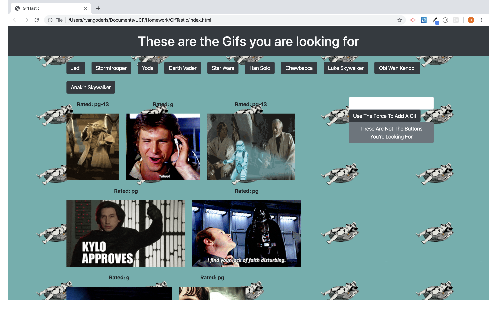

# GifTastic
Giftastic is a JavaScript application that utilizes API calls to the Giphy API.  The user starts with 10 Star Wars themed buttons that will make a call to the giphy api when clicked to display up to 10 of the top gifs based on the button's name.  When the user clicks on one of the gifs it will either play or stop playing depending on it's current state.  The user also has the option to create new buttons with the search bar to search for different gifs.

[GifTastic](https://rgoderis.github.io/GifTastic/)